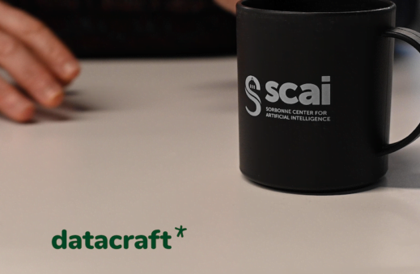

Cet article a été initialement publié le 15/02/2021 dans [Visionary](https://visionarymarketing.com/fr/2021/02/datacraft-data-science-et-ia/?mc_cid=a430616615&mc_eid=0bd4a33d6d), site d'infos des marketeurs et innovateurs visionnaires depuis 1996.

<!--truncate-->

.

.

.

**Job : Voir si possible d'inclure l'audio de l'interview d'Isabelle.**

**Job : Travailler la présentation pour montrer que c'est une vidéo.**

**Job : Rendre visible les légendes des images.**

**Job : Changer le style des citations.**

.

.

.

---

# Datacraft : un club dédié à la data science et l’Intelligence Artificielle

Un club Data Science et IA ? Là où beaucoup veulent absolument qu’on remplace les humains par des robots, les experts de l’IA démontrent la supériorité des échanges humains. Car il y avait un besoin d’échange dans la communauté de la data science et [Isabelle Hilali](https://www.linkedin.com/in/isabelle-hilali-82b5111/), CEO et fondatrice de Datacraft, que [nous avions déjà interviewée](https://visionarymarketing.com/fr/2016/09/big-data-sante-combinaison-necessaire/) ici il y a quelques années, l’avait pressenti. Elle n’a pas hésité à lancer son club data science en plein milieu de la crise du Covid et a démontré, même en ces temps difficiles que tout est possible. Elle a démontré également que la nécessité de se parler, y compris pour les experts de l’IA et de la data science, est plus forte que jamais. Retour sur la création d’un club hors du commun, où se dessine collaborativement le futur de vos logiciels. 

## Datacraft : un club data science et IA installé au cœur de La Sorbonne

<!--  qui héberge Datacraft, le club de la data science et de l’IA qu’elle a créé")
**il manque une légende pour cette image** -->

<figure>
  
  <figcaption>J’ai rencontré Isabelle Hilali dans ses locaux du SCAI (Sorbonne Center for Artificial Intelligence) qui héberge Datacraft, le club de la data science et de l’IA qu’elle a créé</figcaption>
</figure>

<figure>
    
    <figcaption>A single track trail outside of Albuquerque, New Mexico.</figcaption>
</figure>

:::citation

 "J’ai observé que l’univers de la data science et des data scientists est un domaine sur lequel il faut apprendre tout le temps et où tout va extrêmement vite."
 Isabelle Hilali – Datacraft

:::

« En data science, il est vraiment compliqué d’être à la pointe en termes de compétences. C’est un univers où l’on a besoin de partager. On a toujours l’image du geek qui est seul derrière son micro, mais en fait, si on veut être bon, il faut croiser les données et être imaginatif » explique Isabelle.

C’est un univers sur lequel il y a beaucoup de liberté puisque ce sont des métiers très demandés alors que trop peu de bonnes compétences sont disponibles. Les data scientists peuvent donc quelque peu « imposer » la façon dont ils ont envie de travailler. Et ils ont envie de travailler de manière flexible.

> "L’idée, c’était d’avoir un lieu qui donne envie de collaborer"

Le Centre d’intelligence artificielle de la Sorbonne a été imaginé pour permettre de se retrouver pour collaborer. C’est un lieu ouvert. Et c’est là que Datacraft s’est implanté, entre la tour de Jussieu et le jardin des plantes.

<iframe width="85%" height="500px" src="https://www.youtube.com/embed/0xtPrTo-13o" alt="Présentation de datacraft par Isabelle" title="YouTube video player" frameborder="0" allow="accelerometer; autoplay; clipboard-write; encrypted-media; gyroscope; picture-in-picture" allowfullscreen></iframe>

## Un portrait robot du data scientist ? Impossible tant ce mot recouvre des réalités différentes

J’aimerais bien faire un portrait robot de la [data scientist](https://visionarymarketing.com/fr/2015/07/data-scientist/), mais il n’y en a pas beaucoup pour l’instant … Alors j’ai commencé par le data scientist au sens large.

> "Il n’y a pas de portrait robot du data scientist. Ce mot est utilisé un peu à tort et à travers. Il recouvre différentes réalités"

Il y a également le data ingénieur, le data scientist, le data analyst. Il y a besoin de préparer les données, de développer des modèles, d’intégrer aussi tout cela dans le système d’information.

Certains ont une formation assez classique, une grande école d’ingénieurs ou une grande école de math et d’informatique. Mais d’autres ont fait de la musique et ensuite se sont formés à la datascience.

**il manque une légende pour cette image**

Le bon data scientist, qui va être performant dans une organisation, doit être curieux. Il doit être ouvert à l’organisation dans laquelle il est, pour comprendre la situation et éviter de construire des modèles abstraits qui ne serviront à rien. Il doit comprendre les problématiques en allant chercher des données, en faisant de l’apprentissage machine, en développant des modèles, en s’interrogeant sur la meilleure façon d’aider à la connaissance, à la prise de décision.

> "Pour moi, le bon data scientist est quelqu’un d’ouvert et de collaboratif, et qui a des compétences en mathématiques et en informatique, ou au moins la capacité à travailler sur ces sujets"

## La nécessité d’apprendre dans le domaine de la data science

Le besoin principal sur lequel j’avais envie de travailler, était la nécessité d’apprendre en permanence.

Il existe bien des formations en ligne, des formations physiques, des livres, des communautés pour faire de la recherche. Mais il n’existait pas de lieu physique où partager les choses.

**J’ai été assez inspirée par le modèle du compagnonnage**, c’est une chouette façon d’apprendre, avec les autres, en le revisitant un peu, car dans notre modèle, chacun apprend aux autres, il n’y a pas de maître ni d’élève. Chacun est maître sur un bout de sujet.

Je me suis dit qu’il faudrait qu’il y ait des lieux qui permettent aux gens un échange de bonnes pratiques et qui soient pensés pour ça. Et en même temps qui développent la collaboration et la réflexion sur ce qu’on fait, quelles limites on veut donner quand on développe de l’intelligence artificielle.

> "Notre volonté avec Datacraft était de créer ce réseau de lieux pour se retrouver entre experts pour un échange de bonnes pratiques"

## Le lancement de Datacraft, le club data science et IA

J’ai lancé DataCraft en janvier 2020, avec le groupe Accor et l’Insep, les deux premiers membres qui m’ont fait confiance, et dans de supers locaux dans le Marais.

Tout cela a pris forme début février avec l’ouverture des locaux, avec également notre système de résidence où l’on accueille à la fois des chercheurs, et des freelances qui font partie de la communauté, qui ne paient pas d’adhésion, mais qui donnent du temps à la communauté.

Et puis tout a fermé un mois plus tard avec le confinement …

Le concept étant de mettre les gens ensemble et d’avoir cette complémentarité avec ce qui existe en digital, j’ai pensé qu’il allait falloir fermer.

Et puis finalement, on avait encore davantage besoin de cet échange de bonnes pratiques, de cette solidarité entre experts et de cette créativité.

La communauté a énormément grossi. Nous sommes passés de 80 a plus de 500 en fin de confinement, en fédérant des gens qui avaient envie de s’entraider.

## Un club data science : comment ça marche ?

Par exemple, un membre va communiquer sur le développement d’une application en Python, alors qu’il a l’habitude de faire sur [Adobe Air](https://help.adobe.com/en_US/air/build/index.html), et poser la question si d’autres membres ont déjà fait cela pour un type d’applications, pour un tableau de bord par exemple.

La demande est lancée dans la communauté, des membres vont répondre et au lieu que ce soit deux personnes qui se parlent, on en profite pour organiser un atelier, virtuellement pendant le Covid, où les gens vont partager leurs bonnes pratiques. Souvent, à la fin de l’atelier, un atelier suivant se dessine de par les échanges qui ont eu lieu sur par exemple une bibliothèque que les membres n’avaient jamais pensé à utiliser comme ça.

Puis, il y a eu le premier déconfinement et nous avons recommencé à faire des ateliers en physique.

Nous avons organisé un atelier, par exemple, sur les données du sport de haut niveau, avec des problématiques telles qu’aider un entraîneur à optimiser son équipe, à choisir l’équipe qui sera la plus performante en fonction des adversaires, en fonction de données, de météo ou de tout cet environnement.

C’est un prétexte. Sur un projet comme ça, des membres vont venir pendant deux jours travailler ensemble, des gens de l’Insep, de Vinci Autoroutes, d’un labo pharmaceutique, d’une petite startup qui va travailler sur des données des réseaux sociaux, par exemple. Et tous ces gens vont travailler ensemble pendant deux jours.

Contrairement à un hackathon, notre objectif n’est pas de faire un prototype au bout de deux jours qui souvent, en outre, n’est pas très bon.

> "Notre seule volonté est qu’à la fin des deux jours ou de la demi-journée, les participants repartent en se disant  » C’est génial, j’ai appris telle chose »"

C’est ça notre objectif, un échange de bonnes pratiques, où même les « super experts » apprennent quelque chose.

Cela va bien au delà bien sûr. De nombreux partenariats se nouent, qu’on n’aurait jamais imaginé. Un partenariat entre Vinci Autoroutes et le sport de haut niveau par exemple.

Ou encore une startup qui travaille sur les données des réseaux sociaux en santé, qui va découvrir une expertise complémentaire chez un membre de Datacraft, et envisager de monter un gros projet européen sur les fakenews médicales.

Ou encore Danone, par exemple, qui est en train de rédiger sa [charte](https://visionarymarketing.com/fr/glossaire/marketing-ethique/) sur l’utilisation responsable des données, qui la réalise avec d’autres membres qui l’ont déjà fait pour l’écrire ensemble.

## L’avenir pour Datacraft, le club de la data science

L’idée était d’avoir un lieu qui donne envie de collaborer et de se poser des questions sur la façon dont on travaille la data, quelle responsabilité on a envers la société.

L’idée était aussi d’avoir dans Paris un lieu avec un jardin, des plantes, qui favorise cette collaboration et cette réflexion.

Nous sommes au Centre d’intelligence artificielle de la Sorbonne, et cela fait énormément de sens. Le Centre d’intelligence artificielle de la Sorbonne a été imaginé pour permettre à tout l’écosystème de Sorbonne universités, le Museum d’histoire naturelle, l’IRCAM en musique, la fac de médecine, de se retrouver pour collaborer.

C’est un lieu ouvert où les entreprises sont les bienvenues. Etre hébergés ici, à côté du Jardin des Plantes, est complètement en phase avec nos valeurs.

**Dans le futur, il y aura d’autres bases datacraft** qui seront toutes imaginées autour de ce concept de collaboration et de responsabilité.

## Le Covid : crise ou opportunité ?

Cela a été aussi une source de créativité pour nous, Cela nous a permis de faire des choses à distance, et d’avoir, par exemple, des personnes en Ouganda qui nous ont demandé de participer à un atelier. Nous n’aurions pas pu faire ce genre de choses aussi rapidement.

Et puis, ça nous a montré ce besoin de solidarité et d’échange de bonnes pratiques.

> "Même si on espère bien sûr que ça durera pas trop longtemps, cette période a finalement encore renforcé nos valeurs"

