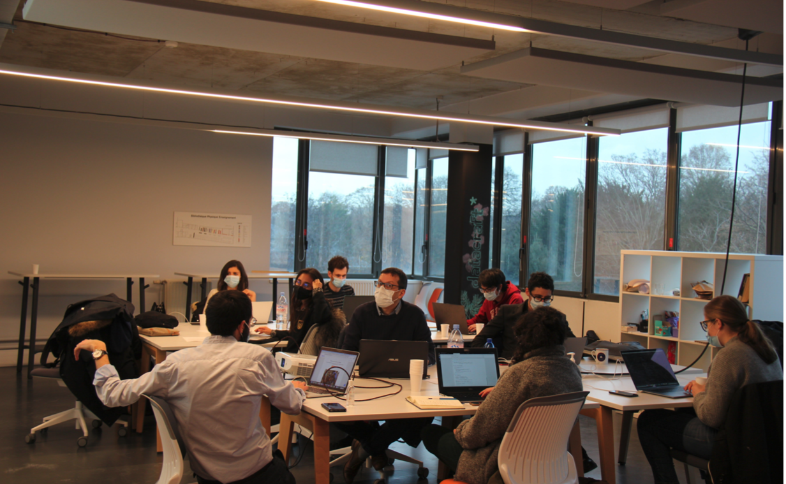
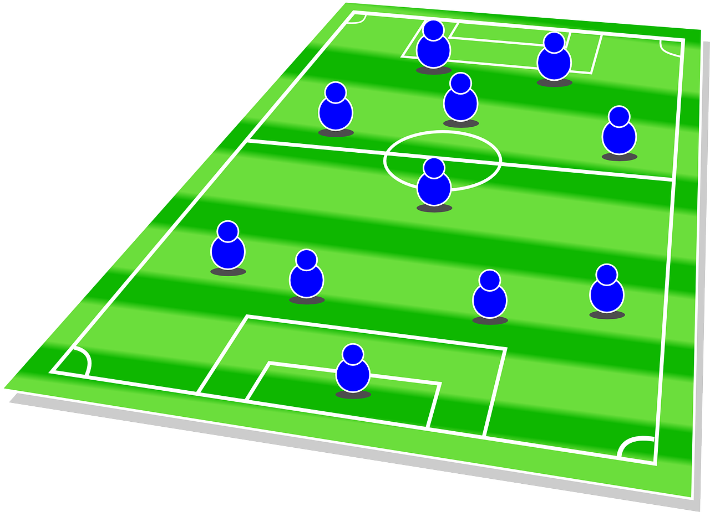

Cet article a été initialement publié le 23/03/2021 dans [binaire](https://www.lemonde.fr/blog/binaire/2021/03/23/lartisanat-de-la-science-des-donnees-avec-datacraft/), blog créé en janvier 2014 dans le journal [Le Monde](https://www.lemonde.fr/blog/binaire/a-propos/) à l’initiative de Serge Abiteboul et de plusieurs collègues de la Société Informatique de France, afin de communiquer sur ce qu’est vraiment l’informatique en tant que science et technique.

<!--truncate-->

.

.

.

**Job : Rendre visible les légendes des images.**

.

.

.

---

# L’artisanat de la science des données avec datacraft

**Image here**
**")
**il manque une légende pour cette image**

**Datacraft**, c’est quoi ce « machin » ? On est à Sorbonne Université **[1]**, dans le Sorbonne Center for Artificial Intelligence, sur le campus de Jussieu, un haut lieu des sciences. Pourtant, ce n’est pas un labo universitaire, même si cela y ressemble. Ça tient du club, un peu du fablab. C’est un espace de cotravail apprenant où on travaille vraiment en commun, plus que dans un espace de cotravail classique. Officiellement, c’est une startup. En fait, ce n’est pas facile à classifier, ce qui est pour moi assez positif dans le monde de la science des données qui se réinvente en permanence.

J’ai été tenté de dire que c’était un « temple des données » tant les données sont au centre des préoccupations de tous et toutes dans ce lieu. Mais non, les données ne sont pas adorées ici, elles sont questionnées, challengées. On vous parle ici de leur mise au service des entreprises et de la société, de « responsabilité sociale des données ».

En fait, la vraie valeur, il faut la chercher dans le nom de l’entreprise, datacraft, en français « l’artisanat de la science des données » (traduction personnelle). C’est tellement plus joli qu’en anglais, même si c’est certainement moins vendeur. Avec datacraft, nous sommes bien dans l’artisanat, dans un savoir-faire spécifique, hors contexte industriel de masse. Nous sommes pile poil dans le compagnonnage en sciences des données, dans l’idée de se former en faisant, en échangeant, en bénéficiant de conseils d’experts.

Je pense qu’un tel compagnonnage est particulièrement bien adapté à la science des données. En 2014, dans un rapport pour le gouvernement **[2]**, nous parlions de la nécessité de booster les formations aux sciences des données, en insistant sur le caractère indispensable de projets « les yeux dans les yeux, de données en vraie grandeur ». Depuis, de telles formations ont vu le jour et les entreprises ont souvent maintenant leurs data scientists. Mais ceux-ci souffrent d’être isolés, de ne pas pouvoir partager leurs questionnements, leurs expériences. L’image du geek qui bosse seul dans son coin est à des kilomètres de la réalité de l’informatique – on travaille le plus souvent en équipe – et tout particulièrement dans la science des données. Un beau projet en science des données met typiquement en jeu des compétences variées que l’on trouve rarement chez une personne unique : gestion de données, big data, machine learning, compétence métier, etc.

**Image here**

**il manque une légende pour cette image**

Les data scientists des entreprises adhérentes à datacraft peuvent venir travailler dans un espace de cotravail où ils rencontreront des data scientists, leurs homologues d’autres entreprises et des experts résidence. Il ne s’agit pas juste de partager de beaux bureaux et du café.  Ils peuvent par exemple dans des ateliers pratiques échanger des idées, apprendre, et partager. Et ce contexte permet aux idées d’infuser entre des domaines différents.

Par exemple, datacraft a organisé un atelier avec l’INSEP (l‘Institut national du sport, de l’expertise et de la performance) autour de l’utilisation de données dans le sport de haut niveau. Il s’agissait d’arriver à construire la meilleure équipe selon le contexte, les adversaires, la météo, etc. Il était difficile de prévoir l’intérêt des ingés de Vinci Autoroutes sur ce sujet, pourtant, ils ont apporté une expertise précieuse.

**Image here**

**il manque une légende pour cette image**

Pas de bol, datacraft s’est lancée en février 2020, pas le meilleur moment pour un concept basé sur un lieu de rencontre physique. Les membres ont initié des projets autour de la santé et de l’éducation, pour aider la société dans un temps de crise sanitaire grave. Je me serais aussi attendu à ce qu’ils découvrent les avantages considérables du travail à distance, d’une certaine inutilité de la rencontre physique. Pas du tout, Isabelle Hilali, fondatrice et pédégère de datacraft, explique : « Pour moi, la dimension physique est essentielle, et j’aimerais revenir dès que possible au présentiel car il est important de garder du lien. » Et quand j’insiste sur les avantages du distanciel, elle précise : « Il faut aussi le plaisir du travail. Il y a moins de plaisir à collaborer à distance. »

Quand on met des gens brillants ensemble, les initiatives fleurissent. Des membres se regroupent pour former des consortiums et répondre à des appels à projets ambitieux auxquels ils n’auraient pas les moyens de répondre individuellement. Ils mettent en place des formations, des espaces d’échanges dans des domaines spécifiques comme les ressources humaines ou les aspects légaux des applications de la science des données.

J’ai parlé de datacraft à des collègues chiliens. Leur réaction : un tel club serait encore plus indispensable au Chili où les data scientists des entreprises sont encore plus isolés qu’en France. Je pense que c’est vrai pour de nombreux pays, datacraft devrait donc s’exporter ? J’ai posé la question : ils ouvrent une base au Maroc en 2022. À quand le Chili ?

Postscriptum : Quand je m’enthousiasme pour une startup dans binaire, il se trouve parfois un de nos très chers lecteurs pour questionner mon objectivité, m’accuser d’avoir des amis dans la startup, d’y avoir investi, voire de me faire payer pour la pub. Et bien non rien de tout cela. J’ai trouvé que c’était une idée géniale et j’ai voulu la raconter.

[Serge Abiteboul](https://fr.wikipedia.org/wiki/Serge_Abiteboul), Inria et ENS, Paris

---

**[1]** Sorbonne Université est une université française située à Paris. Elle a été créée le 1er janvier 2018 par regroupement des universités Paris-Sorbonne (Paris-IV) et Pierre-et-Marie-Curie (Paris-VI), elles-mêmes créées en 1970 et héritières de l’université de Paris fondée en 1896.

**[2]** Serge Abiteboul, François Bancilhon, François Bourdoncle, Stephan Clemencon, Colin De La Higuera, et al. L’émergence d’une nouvelle filière de formation : data scientists », 2014 https://hal.inria.fr/hal-01092062