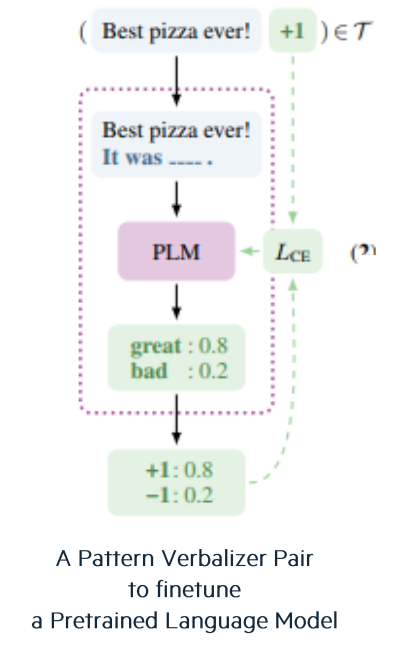
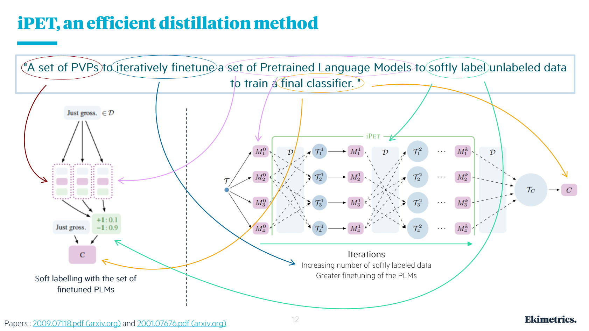

<!--truncate-->

([source](https://numenta.com/blog/2019/08/30/case-for-sparsity-in-neural-networks-part-1-pruning) de l'image de présentaion)

---

## Qu’est ce que le Few Shot Learning (FSL) ? - titre alternatif : Sujet du jour : le Few Shot Learning (FSL)

Il est bien connu que la puissance des méthodes de Machine Learning supervisées, et plus particulièrement de Deep Learning avec les réseaux de neurones, depuis le début des années 2000, a reposé sur la constitution de **grands jeux de données labellisés**. Deux éléments sont importants ici : ‘grands’ et ‘labellisés’.

Pour le premier point, ça représente par exemple des milliers, voire des millions d’images pour la Computer Vision et des millions d’ensembles de phrases pour le NLP. Concernant le second point, il signifie qu’au cours de son apprentissage, l’ordinateur compare son évaluation des données avec le label qu’un intervenant humain a associé à chaque donnée.

Dans le cas du **Few Shot Learning (FSL)**, les chercheurs veulent créer des méthodes capables d’apprendre avec peu de données, i.e. des dizaines ou des centaines, ce qui représente un gain de temps et d’énergie, tout en conservant des performances équivalentes aux modèles traditionnels bien sûr. C’est pourquoi en français on parle d’**apprentissage frugal**. Toutefois, en pratique les méthodes de FSL prennent un modèle traditionnel, pré-entraîné sur un grand nombre de données, et elles le spécialisent sur le cas d’usage via une courte phase d’apprentissage sur le petit jeu de données à disposition ; c’est du fine-tuning. Mais en plus, le Few Shot c’est une méthode qui va au-delà des méthodes traditionnelles, elle permet de faire du semi-supervisé, c’est ce qu’on va voir avec le cas d’usage.

## Le cas d’usage - titre alternatif : C’est quoi le problème ?!

Ekimetrics s’est intéressé à l’apprentissage frugal pour exploiter les énormes jeux de données des petits commentaires quotidiens sur internet, avec une problématique de gain de temps… De la frugalité avec des énormes jeux de données ? On vous explique !

Mieux que le seul nombre d’étoiles d’un restaurant ou d’un hôtel, il s’agit de prendre en compte les avis dans les tweets, les posts, les brèves… qui sont par essence des données non labellisées et de les exploiter. L’annotation humaine de ces avis est inenvisageable. Ça coûterait trop cher, ça prendrait trop de temps, et il faudrait recommencer tous les jours pour suivre l’évolution du sentiment. En l'occurrence, pour la recherche d’Ekimetrics, le sujet d’étude porte sur des commentaires de restaurants.

Mais si la machine était capable d’évaluer les commentaires, à 2 Gigahertz, tout de suite le problème serait réglé. C’est là que le Few Shot, en utilisant la méthode PET, peut devenir utile.

Dans la suite, nous vous présentons la méthode PET, comment l’utiliser dans le cadre du FSL et enfin, comment Ekimetrics l’utilise sur les avis des consommateurs.

## PET qu’est ce que c’est ?

**PET** est l’acronyme de ‘**Pattern Exploiting Training**’. La méthode repose sur un ensemble fixe et prédéfini de **patterns** et de **verbalizers** et un **Pre-trained Language Model** a.k.a. **PLM**. Les patterns sont les phrases à trou (“It was…”, “Just…!”, “All in all, it was…”, “In summary, the restaurant is…”) et les verbalizers sont les mots qui peuvent compléter ces phrases et auxquels sont associées des notes chiffrées. On commence à retrouver les nombres que l’ordinateur aime tant !

Concrètement, reprenons notre exemple des évaluations des restaurants, la méthode consiste à :
 - prendre un commentaire,
 - y associer aléatoirement un pattern,
 - soumettre le tout au PLM qui va le compléter en choisissant un verbalizer.

<!-- { width=50 height=50 } -->

{:.image-left}

<!-- style="float: left"; margin-right: 10em; height="25%" width="25%"} -->

<!--  -->

<!--  -->

Par exemple (voir Fig. 1), avec le commentaire “Best pizza ever!”, on construit la phrase à trou : “Best pizza ever! It was … .” que le PLM va compléter avec ‘great’ avec une confiance de 0.8, sachant que ce mot est noté +1.

## FSL + PET : première application aux avis internet

Revenons à la masse brute des avis des consommateurs sur internet. **PET est la méthode** pour associer une note à un commentaire, le **FSL est le moyen** de traiter automatiquement tout le jeu de données, et le travail de l’algorithme se fait en deux étapes.

Dans un premier temps, on labellise un petit nombre de commentaires, une centaine par exemple, ce qui signifie qu’on associe une paire pattern plus verbalizer à ces commentaires, et on finetune le PLM avec cette centaine. Puis, une fois le PLM spécialisé, on le laisse labelliser tout le reste du jeu de données, automatiquement. Ça en fait une méthode semi-supervisée d’analyse de sentiment des commentaires.

Cependant, cette application basique présente des limites. D’une part, le verbalizer donné par le PLM peut ne pas être le plus adapté au commentaire et, d’autre part, c’est très ambitieux de spécialiser le PLM une fois sur une centaine d’exemples pour ensuite en traiter des dizaines de milliers ou plus. C’est pourquoi les chercheurs ont développé une méthode de distillation qui augmente la robustesse de PET, c’est la méthode **iPET : iterative PET**.

## i(terative)PET : une méthode de distillation astucieuse

Une image peut valoir mille mots…

… Mais quelques mots seront quand même nécessaires pour expliquer cette image !

Tout d’abord, le schéma de gauche sur la figure présente l’adaptation de PET qui permet d’obtenir le label le plus adapté au commentaire… en moyenne. En effet, il s’agit ‘simplement’ de **faire travailler des méthodes PET indépendantes en parallèle** (trois sur le schéma). Les trois cellules ont le même PLM au départ, et elles travaillent sur les mêmes commentaires, mais avec des patterns différents. Dans la phase d’entraînement sur les données labellisées, les PLMs se spécialisent différemment. Puis, durant la phase de travail, pour un même commentaire ils produisent des **paires pattern-verbalizers** (appelées **PVPs** sur le schéma) indépendamment les uns des autres ; possiblement les mêmes, mais pas avec les mêmes probas. Enfin, **en sortie** ces (trois) labels sont utilisés pour calculer **un soft-label**, i.e. un **label moyen**.

Ensuite, sur la droite est présenté le caractère itératif de la méthode iPET. Elle consiste à diviser le jeu labellisés sur plusieurs itérations (indiquées par les exposants allant de 0 à k) et à diviser encore à chaque itération entre plusieurs méthodes parallèles (indiquées par les indices allant de 0 à 4). Mais attention, chacun des quatre modèles ici fait du soft-labelling comme présenté à gauche de la figure, c’est-à-dire qu’ils contiennent plusieurs méthodes en parallèle.

Donc, si l’on suppose que l’on part pour trois itérations, l’information labellisée est distillée de la manière suivante. À l’itération 0 sur le schéma, on prend un tiers des données labellisées, et on fournit un quart de ces données à chaque modèle pour le finetuner, avant de prendre un tiers des données à labelliser et d’en fournir un quart à chaque modèle pour soft-labellisation. Ce qui constitue la fin de la première itération.

À la deuxième itération - itération 1 sur le schéma, on commence à nouveau par un phase de fine-tuning, mais avec un jeu de données labellisées constitué pour partie des données annotées par un être humain (le deuxième tiers), et pour partie de données soft-labellisées. Toutefois, on fait attention à ce qu’un modèle ne s’entraîne pas avec des données qu’il a lui-même soft-labellisé, pour éviter qu’il renforce ses biais… on distille ! Par exemple sur le schéma, à l’itération 1, le jeu d’entraînement T fourni au modèle 4, i.e. T14, est constitué de données soft-labellisées par les modèles 1 et 2, en plus des données annotées par l’humain. Puis on prend le deuxième tiers de données à annoter, on en fournit un quart à chaque modèle pour soft-labellisation et on finit la deuxième itération.

Pour la troisième itération, vous avez compris le principe je pense…   

À la fin, les millions de commentaires sont plutôt bien soft-labellisés, à la vitesse de la machine et au coût de l’électricité, tout est prêt pour un classifieur sur le schéma d’Ekimetrics et je vous ai expliqué tous les termes entourés sur la figure et présenté toutes les étapes. 

## Avantages, inconvénients, limites et améliorations.

Nous avons déjà vu certains des avantages. Internet est une place sur laquelle il y a pléthore d’avis en tout genre : films, restaurants, hôtels, produits de grande consommation, lieux divers… Annoter ces données serait un travail coûteux et sans fin, nous l’avons dit. L’approche iPET permet d’automatiser cette étape, à la vitesse de l’ordinateur et quel que soit le cas d’étude.

Du point de vue des performances, Ekimetrics a indiqué avoir une précision de 88% avec seulement 50 données labellisées au départ, et même 84% avec 10 données labellisées !! En comparaison, les modèles supervisés peuvent atteindre des précisions de 99%, mais au prix d’un énorme travail de pré-traitement. C’est donc un pas conceptuel de plus dans la réduction de la supervision.

Toutefois, le domaine d’application se restreint à des données textuelles assez courtes d’une part. Et d’autre part, la charge de travail est déplacée vers une bonne conceptualisation du cas d’étude. Les résultats sont extrêmement dépendants de la formulation des patterns et des choix de verbalizers (i.e. choix du prompting). Ceux-ci impliquent une grande variabilité qui n’est pas maîtrisée. De plus le PLM utilisé - un modèle BERT dans le cas d’Ekimetrics, cache des inconnues sur le corpus qui a servi à son entraînement, son domaine d’applicabilité, ses paramètres. On touche là à une limite dans laquelle l’IA n’est plus tout à fait de l’open science.

---

# Notes de Xavier que je n'ai pas mises

## LIMITES et PISTES D'AMÉLIORATIONS

PLM ou Foundation modèle avec quelles données a-t-il été entraîné ???

Que donnerait l’utilisation de plusieurs PLM ?

une amélioration de ces approches est proposé dans le papier [https://arxiv.org/pdf/2103.11955.pdf](https://arxiv.org/pdf/2103.11955.pdf). 
