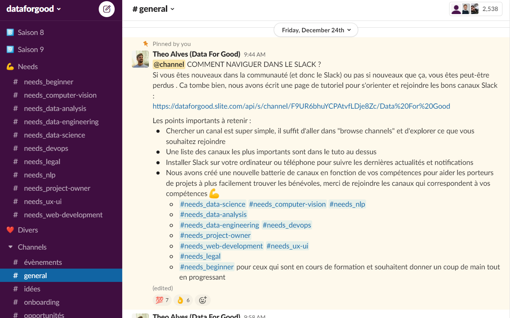

Ceci est un lien vers un site qui liste les balises HTML avec des exemples (!!) : https://developer.mozilla.org/fr/docs/Web/HTML/Element/Img

Essentially stupid thing you can find anywhere on the web because they're basics. But you're lazy man!!

<!--truncate-->

# Ceci est une liste avec un titre

## Etre un bénévole Data For Good
Mais en pratique être bénévole cela veut dire : 
- Faire partie d'une communauté tech engagée
- Participer aux saisons d'accélération
- ... Bref, Data For Good est une communauté libre et indépendante, tu peux proposer ce que tu veux !

Pour plus de détails tu peux lire la page [suivante](https://dataforgood.slite.com/p/channel/F9UR6bhuYCPAtvfLDje8Zc/notes/t1KTZaDgs). 

---

## Le Slack Data For Good
Slack est un outil de messagerie communautaire, c'est aujourd'hui le coeur de la communauté où se passe les discussions entre volontaires, l'organisation autour des projets, et où se partagent évènements, offres d'emploi, liens et actualités de l'association. Pour rejoindre le Slack, c'est simple il suffit de remplir le questionnaire ci-dessus. 

---

# Internal links

Visitez la page [🔥 Blog](/blog) pour découvrir nos accélérations depuis 2014.

---

# Un bouton cliquable qui redirigent vers un site extérieur

<a href="https://airtable.com/shrPjA75ckEgQdPUF" target="_blank" className="button button--secondary button--lg button-home">
Rejoindre la communauté - 5min ⏱
</a>

<iframe id="inlineFrameExample"
    title="Inline Frame Example"
    width="300"
    height="200"
    src="https://www.openstreetmap.org/export/embed.html?bbox=-0.004017949104309083%2C51.47612752641776%2C0.00030577182769775396%2C51.478569861898606&layer=mapnik">
</iframe>

---

# Include an audio reader

<!-- <figure>
    <figcaption>Listen to the T-Rex:</figcaption>
    <audio
        controls
        src="roar.wav" type="audio/wav">
            Your browser does not support the
            <code>audio</code> element.
    </audio>
</figure>

<audio
    controls
    src="Kalimba.mp3">
        Your browser does not support the
        <code>audio</code> element.
</audio> -->

<!-- <audio controls="controls">
  <source src="toto.wav" type="audio/wav">
  Votre navigateur ne prend pas en charge l'élément <code>audio</code>.
</audio> -->

---

# Un lecteur intégré de vidéos (Youtube)

<iframe width="85%" height="500px" src="https://www.youtube.com/embed/0xtPrTo-13o" alt="Présentation de datacraft par Isabelle" title="YouTube video player" frameBorder="0" allow="accelerometer; autoplay; clipboard-write; encrypted-media; gyroscope; picture-in-picture" allowFullScreen></iframe>

---

# Faire des blocs tips, infos, 

:::tip On peut mettre un titre ici (pas obligatoire)

**La charte va au-delà du cadre législatif** afin de promouvoir l’utilisation éthique des données et de prévenir de potentiels scandales liés aux données et à l’intelligence artificielle. L’objectif est de faire grandir la responsabilité individuelle et collective des data scientists en suscitant une réflexion et des échanges sur l’impact social de leur activité professionnelle.

:::

:::info

**La charte va au-delà du cadre législatif** afin de promouvoir l’utilisation éthique des données et de prévenir de potentiels scandales liés aux données et à l’intelligence artificielle. L’objectif est de faire grandir la responsabilité individuelle et collective des data scientists en suscitant une réflexion et des échanges sur l’impact social de leur activité professionnelle.

:::

:::info Data For Good

La communauté Data for Good compte plus de 2500 volontaires qui consacrent plusieurs heures par semaine au service de projets d'intérêt général.

Vous êtes Data Scientists/Analyst/Engineers, Developers, UX/UI designer, ou Project Manager ? [Rejoignez-nous](https://airtable.com/shrPjA75ckEgQdPUF) !

:::

:::tip Rejoindre la communauté Data For Good

Pour rejoindre la communauté, il vous suffit de remplir ce [questionnaire](https://airtable.com/shrPjA75ckEgQdPUF) ! 
Il vous sera donné un accès au [Slack](#le-slack-data-for-good) qui est le coeur de la communauté.

:::

---

# Faire des capsules dépliantes

Principe #4 - Ne pas collecter ou utiliser de **données inutilement personnelles et/ou sensibles**.

*Etape projet (2): Je collecte ou je dispose de données*

... et une « donnée sensible » ?

L’[article 9 du Règlement Général sur la Protection des Données (RGPD)](https://www.cnil.fr/fr/reglement-europeen-protection-donnees/chapitre2#Article9) prévoit que « le traitement des données à caractère personnel qui révèle l'origine raciale ou ethnique, les opinions politiques, les convictions religieuses ou philosophiques ou l'appartenance syndicale, ainsi que le traitement des données génétiques, des données biométriques aux fins d'identifier une personne physique de manière unique, des données concernant la santé ou des données concernant la vie sexuelle ou l'orientation sexuelle d'une personne physique sont interdits ».

Ici un peu de texte.

---

# Une image et du texte côte à côte.... Ne marche pas !!

<section className="light-green">
          

            <h1>L'association Data For Good</h1>
            

              

                
              

              

                
Data For Good est une association loi 1901 (<i>100% bénévole, 100% open-source, 100% citoyenne</i>) créée en 2014 qui rassemble une communauté de <b>2700+ volontaires</b> tech (Data Scientists, Data Analysts, Data Engineers, Developers, UX/UI Designers, Product & Project Owners) souhaitant mettre leurs compétences au profit d'associations, d'ONG, et de l'ESS - et de s'engager pour l'intérêt général.

                
Nous réalisons chaque année des <b>saisons d'accélération où une dizaine de projets sont accompagnés par les bénévoles sur des thématiques sociales, sociétales et environnementales</b>. Nous avons ainsi accompagné, accéléré et co-construits plus de 100 projets depuis 2014.

                
Nous sommes également fervents <b>critiques des risques et des dérives de la technologie</b>, faire partie de la communauté est aussi s'engager pour une technologie sobre et respectueuse des enjeux sociaux et environnementaux, et accepter que la technologie n'est pas la solution à tous les problèmes.

              

            

          

        </section>

---

# Different kinds of links

* Airtable : https://airtable.com/privacy 
* Mailchimp : [https://mailchimp.com/legal/privacy/](https://mailchimp.com/legal/privacy/) 
* Slack : https://slack.com/trust/privacy/privacy-policy

<!-- THis kind of link does not work when deploying on GitHub, i.e. it is recognized as a broken link.
* Zapier : [https://zapier.com/privacy/](1) 

[1]: https://zapier.com/privacy/ -->

