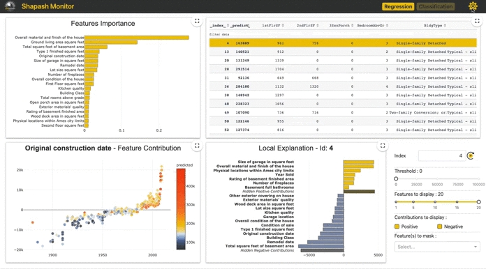
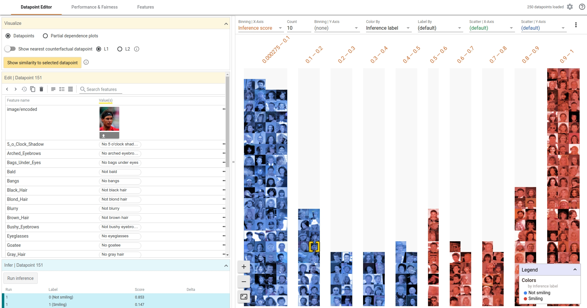
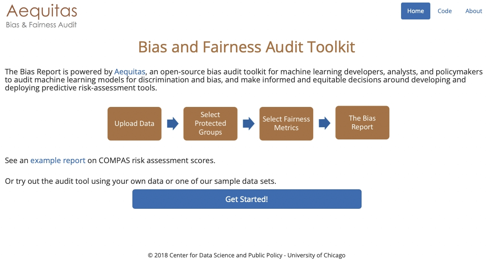
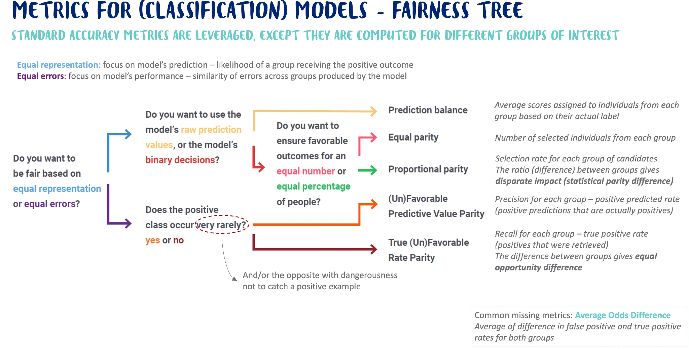
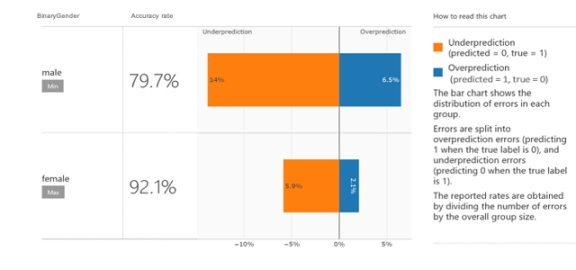
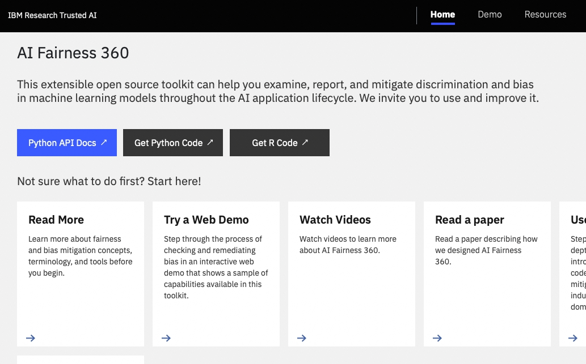

<!--truncate-->

**TODO**  
**- Mettre quelque chose pour author_title.**  
**- Mettre les keywords les plus pertinents.**  
**- Écrire une description en env. 10 mots.**  
**TODO**

---

# Fairness in AI - How a benchathon unlocked our knowledge
Welcome to the second article of a series that aims at sharing how a group of private players (Danone, Ekimetrics, datacraft), researchers (Telecom Paris, Inria), and students (Université de Cergy), partnered to uncover fairness & ethics in Artificial Intelligence from a practical standpoint. The group tried to tackle the following challenge: “how should a Data Scientist concretely react when exposed to fairness concerns?”. If you are interested to understand how this initiative kick started, have a look here **TODO : Link to article**.

This article casts a light on the benchathon - definition below - in which the group participated to get a quick and documented opinion of an already rich fairness/ethical ecosystem. It first explains how the concept of benchathon accelerated our practical grasp of the topic, and then explores the first conclusions drawn about the fairness ecosystem.

## Benchathon as an innovation catalyst
At this stage of our “fairness journey”, we had a decent high level understanding of what fairness could imply in real life. It was then the right time to start acting concrete: try and derive a pragmatic methodology, even if it implied implementing our own routines.

To that end, a very first step was to make sure we’d not reinvent the wheel, and we’d plainly benefit from existing open source contributions. This happened during a one-day benchathon. If you work in tech, you may already be familiar with the following two notions:
 - Benchmark: *gathering and comparing qualitative information about how an activity is conducted through people, processes, and technology* (Source: https://www.apqc.org/blog/what-are-four-types-benchmarking)  
 - Hackathon: *[short] event [...] in which computer programmers and others involved in software development [...] collaborate intensively on software projects* (Source: https://en.wikipedia.org/wiki/Hackathon)  

Hackathons usually involve teams that compete on the “same topic” for 2 to 3 days. Because we were limited in time - 1 day, rather than focusing all on the same “thing”, we decided to make the most out of the presence of 9 data scientists: we shared and split between us the technical analysis of several fairness open source libraries - [AIF360](https://github.com/Trusted-AI/AIF360), [Shapash](https://github.com/MAIF/shapash), [Aequitas](https://github.com/dssg/aequitas), [What if tool](https://research.google/teams/brain/pair/) **TODO: j'ai l'impression que ce lien n'est pas le bon**, [Fairlearn](https://fairlearn.org/). Hence the concept of benchathon.

Even though all of us were entitled as “Data Scientists”, we all came from different structures, different backgrounds, and different (coding) habits. That diversity definitely triggered (and still does) great discussions and perspectives along the initiative. Still, an important step during the benchathon was to settle on an interpretation grid that would make the outcome as reusable and general as possible, and as unbiased as possible - in line with the topic then :). A few criteria were identified:

<table>
<tr><th>   <strong>Criteria</strong>                  </th><th>    <strong>Description</strong>                                                                                                             </th><th>   <strong>Scale</strong>           </th>  </tr>
<tr><td align="left" bgcolor="white"> Installation  </td><td align="left" bgcolor="white"> How easy is it to get started?                                                                               </td><td align="left" bgcolor="white"> 1-5 </td>  </tr>
<tr><td align="left" bgcolor="white"> Usability     </td><td align="left" bgcolor="white"> How easy to use is the API?                                                                                  </td><td align="left" bgcolor="white"> 1-5 </td>  </tr>
<tr><td align="left" bgcolor="white"> Documentation </td><td align="left" bgcolor="white"> How well documented is the library?                                                                          </td><td align="left" bgcolor="white"> 1-5 </td>  </tr>
<tr><td align="left" bgcolor="white"> Completeness  </td><td align="left" bgcolor="white"> Does the library perform everything it is supposed to?                                                       </td><td align="left" bgcolor="white"> 1-5 </td>  </tr>
<tr><td align="left" bgcolor="white"> Reliability   </td><td align="left" bgcolor="white"> Does the library seem reliable? (code quality, tests, …)                                                     </td><td align="left" bgcolor="white"> 1-5 </td>  </tr>
<tr><td align="left" bgcolor="white"> Legitimacy    </td><td align="left" bgcolor="white"> Is the library popular within the community? (number of stars on GitHub, latest commit, number of issues, …) </td><td align="left" bgcolor="white"> 1-5 </td>  </tr>
<tr><td align="left" bgcolor="white"> Future        </td><td align="left" bgcolor="white"> Gut instinct - would you trust it and use it in real projects?                                               </td><td align="left" bgcolor="white"> Y/N </td>  </tr>
<tr><td align="left" bgcolor="white"> Weaknesses    </td><td align="left" bgcolor="white"> What is currently missing?                                                                                   </td><td align="left" bgcolor="white"> N/A </td>  </tr>
</table>

That being set, what was important was also to pace the day, so that despite the fact that small groups worked independently, we always kept an overall coherence and dynamics. It meant:
 - Mini sprints of 1,5 hours
 - At the end of each mini sprint, a quick roundtable to share insights or blocking points, and get challenged by the whole group
 - Lunch break altogether: everyone brought something to share. This was a great moment of conviviality. It would even seem that a new datacraft initiative was born at this very moment, stay tuned!
 - At the end of the day, wrap up session during which each group made a demo of the library it spent the day on, and made sure to fill out above-mentioned criteria. The latter was especially important because this is what helps us today to have a concrete reference that every one can refer to.

Taking a step back, below are a few takeaways:
 - This benchathon was extremely productive: in the matter of only a day, our practical grasp of the fairness/ethical ecosystem clearly passed a milestone (see next section).
 - All people around the table had a developer background, and the same objective - namely, uncovering the fairness topic from a technical & practical standpoint. It helped to get started fairly quickly, and proved that this format was a great fit for that audience and purpose.
 - One mistake we made was not to invest enough time beforehand in mapping the main open source libraries available in the AI community. It turns out we missed what would become our GO TO in the future: [Dalex](https://github.com/ModelOriented/DALEX).

## Highlight of 6 ethical/fairness libraries
If you are further interested in the exhaustive findings on the five libraries that were studied during the benchathon, please follow this [link](https://docs.google.com/spreadsheets/d/1Z071Ih9S7XYEcXBoX4k7SNoy6Z5DqbUM6htcpn1J_WU/edit#gid=0). The following section aims at providing a (subjective) summary of these libraries, in increasing relevance order, with respect to fairness / ethics.

### Shapash
[Open source library](https://github.com/MAIF/shapash) developed by MAIF - a French insurance actor, and Quantmetry - a French AI consultancy, that mainly focuses on interpretability (no built-in fairness-oriented feature). It acts as a layer on top of the usual interpretability toolbox (feature importance, SHAP values, …). It comes with a very decent web interface, high quality code, and a great community/documentation. It also provides an audit report of the project (from data prep to modeling, to exploratory analysis).

In a nutshell: great project, but not that relevant (yet?) for fairness topics.

Screenshot of Shapash. <a target="_blank" rel="noopener noreferrer" href="https://github.com/MAIF/shapash">Credits</a>.

### What if tool
[Open source interface](https://pair-code.github.io/what-if-tool/) developed by Google. It mainly aims at conducting counterfactual analysis (“what would be the machine learning model prediction if we changed the value of that particular attribute, like the sex e.g.?”). It comes with a decent web interface, especially to deal with unstructured data like images. Documentation is however not handy to deal with.

In a nutshell: great interface. However, counterfactual analysis is only one (important) feature among the different aspects related to fairness, which in turn does not justify a lock-in with that specific tool.

Screenshot of What-if tool. <a target="_blank" rel="noopener noreferrer" href="https://github.com/pair-code/what-if-tool">Credits</a>.

### Aequitas
[Aequitas](http://aequitas.dssg.io/) is a bias and audit toolkit developed by Carnegie Mellon University. It aims at spotting unfair allocation compared to population repartition or wrong decisions about certain groups of people. It comes with a web interface (which we could not make work) and a Python library to help compute fairness metrics. Documentation is decent, especially their representation of the ["fairness tree"](http://www.datasciencepublicpolicy.org/our-work/tools-guides/aequitas/), which helps to navigate the (many and ambiguous) fairness metrics, depending on the use case.

In a nutshell: Aequitas is a tool that has been available for quite some time now, but that does not benefit from a living community. To be kept under the radar (or contribute to!).

Screenshot of Aequitas web application. <a target="_blank" rel="noopener noreferrer" href="http://aequitas.dssg.io/">Credits</a>.

### Fairlearn
[Fairlearn](https://fairlearn.org/) is an open source library maintained by diverse contributors (from Microsoft, Zalando, …). It aims at tackling each step of the fairness value chain. It implements fairness metrics, of which you have a summary below:

Credits: <a href="#reference">[1]</a> - complemented by datacraft’s ethical initiative.

Fairlearn implements mitigation techniques:
 - Pre-processing methods: alter a training set before training a model (example in fairlearn: removing sensitive correlations)
 - In-processing method: train a model (or a sequence of models) accounting for fairness constraints (example in fairlearn: exponentiated gradient [[2]](#reference))
 - Post-processing methods: alter predictions to account for fairness constraints, once a model is trained (example in fairlearn: threshold optimization post processing algorithm [[3]](#reference))

It also tries to go beyond the usual binary classification problem, which is the usual go-to when uncovering the fairness topic (e.g. giving a try at regression). However, making our way through the “get started” procedure or the documentation - yet well designed and appealing, was no easy task. Note that the library also comes with nice dashboards that allow, among others, model comparison.

In a nutshell: promising and active library for fairness topics. Accessibility could be improved. To definitely keep an eye on (or contribute to!).

Screenshot of the Fairlearn dashboard. <a target="_blank" rel="noopener noreferrer" href="https://opendatascience.com/how-to-assess-ai-systems-fairness-and-mitigate-any-observed-unfairness-issues/">Credits</a>.

### AIF360
[AIF360](http://aif360.mybluemix.net/) is an open source library developed by IBM. From our perspective, and before doing this initiative, this library was considered as the go-to for tackling fairness topics. It comes with an online tool, implements a wide range of mitigation techniques:
 - Pre-processing methods among which reweighting [[4]](#reference), or learning fair representations [[5]](#reference)
 - In-Processing methods: grid search reduction [[6, 7]](#reference)
 - Post-processing methods: equalized odds postprocessing [[8, 9]](#reference)

It also benefits from a wide community, and comes with a user-friendly web interface. 

However rich in terms of features / mitigation techniques, the documentation is quite poor (it is not unusual to go and directly look into the source code to get answers). Besides, (useful) snippets of code are disseminated in various Jupyter notebooks, which slows down the appropriation. Last, some choices regarding data representation (formatting) and/or object declaration/instantiation (like the main explainer object, which is quite verbose), led us to troubles when trying to get used to the library.

In a nutshell: AIF360 is a very rich and mature ecosystem. Accessibility is however currently an obstacle to its full exploitation.

Screenshot of AIF360. <a target="_blank" rel="noopener noreferrer" href="https://aif360.mybluemix.net/">Credits</a>.

## Conclusion
At this point in time, we had discovered very interesting libraries, some of them backed by great communities and capabilities. Still, some open points remained that we thought would be worth investing time on:
 - There was no clear winner: each library came with pros and cons. An ideal tool should be able to combine the best of each.
 - All those tools were very much focused (and still are) on the tooling, namely implementing a wide set of mitigation techniques or fairness dashboards. However, we were still missing a systematic framework for tackling fairness topics, that not only would make practical tools available, but that would also provide the associated reasoning: what question should a data scientist ask themselves? In which situation? Who should take part in this or that sensitive decision with respect to the model, …?

This is what will be tackled in the third article of this series. We’ll introduce Dalex, another library that will be used as a foundation to derive (our interpretation of) the whole reasoning when exposed to fairness / ethical concerns.

## Reference

[1] - Credits: Data Robot – Trusted AI 102: A Guide to Building Fair and Unbiased AI Systems  
[2] - [Agarwal et al. (2018)  A Reductions Approach to Fair Classification](https://arxiv.org/abs/1803.02453)  
[3] - [M. Hardt, E. Price, N. Srebro (2018) - Equality of Opportunity in Supervised Learning](https://arxiv.org/pdf/1610.02413.pdf)  
[4] - F. Kamiran and T. Calders, "Data Preprocessing Techniques for Classification without Discrimination," Knowledge and Information Systems, 2012  
[5] - R. Zemel, Y. Wu, K. Swersky, T. Pitassi, and C. Dwork, "Learning Fair Representations." International Conference on Machine Learning, 2013  
[6] - [A. Agarwal, A. Beygelzimer, M. Dudik, J. Langford, and H. Wallach (2018) - A Reductions Approach to Fair Classification - International Conference on Machine Learning](https://arxiv.org/abs/1803.02453)  
[7] - [A. Agarwal, M. Dudik, and Z. Wu (2019) - Fair Regression: Quantitative Definitions and Reduction-based Algorithms - International Conference on Machine Learning](https://arxiv.org/abs/1905.12843)  
[8] - M. Hardt, E. Price, and N. Srebro, "Equality of Opportunity in Supervised Learning" Conference on Neural Information Processing Systems, 2016.  
[9] - G. Pleiss, M. Raghavan, F. Wu, J. Kleinberg, and K. Q. Weinberger, "On Fairness and Calibration," Conference on Neural Information Processing Systems, 2017.  