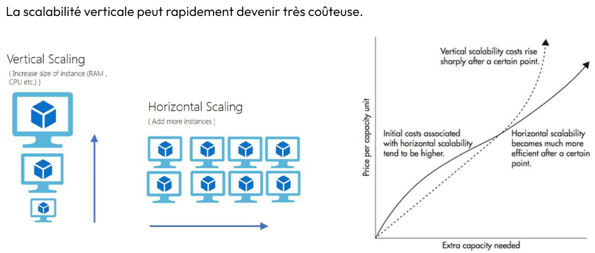
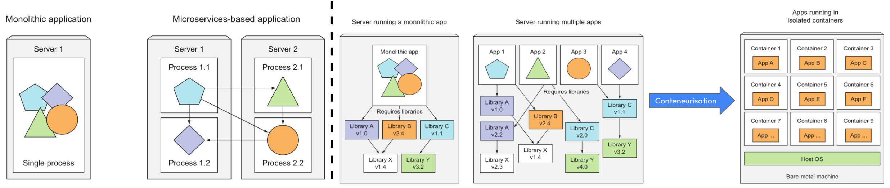

import Tabs from '@theme/Tabs';
import TabItem from '@theme/TabItem';

<!--truncate-->

---

# Pourquoi Kubernetes ?

Sorti pour la première fois en 2015, [Kubernetes](https://en.wikipedia.org/wiki/Kubernetes) est devenu la solution d’orchestration de conteneurs privilégiée par les entreprises. Pourquoi cela ?  
Imaginez une application que vous mettez en ligne. A mesure qu’elle devient populaire, elle doit pouvoir être ‘requêtée’ de manière massive et, dans son ensemble, elle traite des volumes de données de plus en plus gros. Une tension apparaît alors sur deux caractéristiques de la machine :
* Vitesse de calcul : d’une part le CPU ne peut pas gérer toutes les demandes des utilisateurs dans un temps raisonnable,
* Capacité mémoire : d’autre part la RAM du CPU ne peut pas supporter l’ensemble des données de tous les utilisateurs. @fig1:descr

Il n’existe que deux façons de gérer ce problème de capacité (cf [Figure 1](#Figure1)).  
Avant la généralisation des technologies de conteneurs, la solution la plus adoptée était la **scalabilité verticale** : on prenait une machine plus puissante. C'est-à-dire avec un CPU plus performant, voire un GPU, et une RAM plus grande (e.g. 32Gb, 64Gb, jusqu’à 1Tb). Mais c’est une stratégie du “toujours plus puissant” qui peut rapidement atteindre ses limites, dont la première est le coût qui grandit de manière quasi-exponentielle (voir graphe à droite de la [Figure 1](#Figure1)).  
Pour remédier à ça, on peut pratiquer la __scalabilité horizontale__ : on met deux machines en parallèle et on répartit le travail sur chacune. Ça a aussi un coût financier, mais passée une certaine limite il est moindre que celui de la scalabilité verticale. Par contre il faut maintenir plusieurs machines : les mettre à jour et installer les librairies deux fois, i.e. s’assurer qu’elles offrent le même environnement fonctionnel à l’application. Pire, si on veut avoir des redondances pour pallier l’arrêt imprévu d’une machine, voire des deux, on doit s’occuper de quatre machines à minima !

Kubernetes, également appelé k8s, fait partie des technologies qui ont rendu la scalabilité horizontale très facilement applicable.

Figure 1 : Illustration des scalabilités verticale et horizontale.

# Principes de base de k8s.

Le fonctionnement de Kubernetes repose sur une **stratégie de microservices conteneurisés**.  
Pour préciser les choses, nous allons maintenant préciser quelques fonctionnalités de notre application. Imaginez qu’elle prend des informations clients qu’elle compare à une base de données pour des programmes de fidélité, et, en même temps, elle dispose d’un algorithme de recommandation qui doit proposer un contenu adapté à l’utilisateur selon les produits disponibles d’après une autre base de données. Voilà déjà une application assez complexe.

Auparavant, une telle application était construite de façon dite ‘monolithique’ (voir Figure 2, panneau de gauche). C’est à dire que les différentes fonctionnalités de l’application n’étaient pas forcément indépendantes et surtout elles tournaient toutes sur la même machine ; celle que l’on voulait toujours plus puissante.
La stratégie de micro-services consiste à construire chacune des fonctionnalités - ou chacun des services - de manière indépendante des autres, par une “petite” équipe autonome. Les équipes n’ont qu’à s’accorder sur un standard de communication entre les services et éventuellement à le faire évoluer progressivement. Chaque micro-service tourne ensuite sur un serveur dédié et peut être indépendamment scalable et déployable.  

:::tip Vocabulaire  
<Tabs>
  <TabItem value="Indépendamment scalable" label="Indépendamment scalable">S’il y a une trop grande tension pour accéder à la base de données des utilisateurs par exemple et que ce service devient trop lent, on peut augmenter le nombre de machines dédiées à ce service seulement et répartir la charge sans affecter les autres.</TabItem>
  <TabItem value="Indépendamment déployable" label="Indépendamment déployable">Si on améliore l’algorithme de recommandation de contenu, on peut redéployer ce service seulement puis arrêter les serveurs qui font tourner l’ancien algorithme progressivement ; comme ce service est indépendant des autres, la seule précaution à prendre est de s’assurer que leur standard de communication est toujours valide.</TabItem>
</Tabs>
:::

Cette stratégie de microservices représente la scalabilité horizontale. Toutefois, faire tourner le même service sur plusieurs serveurs, ça implique de maintenir toutes ces machines et de s’assurer qu’elles fournissent toutes le même environnement au service en question, i.e. mêmes librairies avec les mêmes versions. Et c’est là que la conteneurisation devient un atout majeur. Pour chaque service il suffit d’écrire toutes les exigences de librairies dans un fichier, puis de lancer un conteneur Docker à partir de ce fichier.  
Au passage cela règle un autre problème présenté sur le panneau de droite de la Figure 2. Différentes applications installées sur un même serveur pouvaient avoir besoin des mêmes librairies mais avec des versions différentes, qui elles-mêmes pouvaient appeler différentes versions d’autres librairies. Et les équipes techniques devaient trouver les moyens de les installer toutes de manière concurrente et de s’assurer que les bonnes versions étaient appelées au bon moment. La conteneurisation enlève tout simplement ce problème.  

En conclusion, **k8s** est un moyen unique et simple de gérer une myriade de micro-services interconnectés de manière conteneurisée, c’est un **orchestrateur de conteneurs**.

Figure 2 : Write some text here... This fig is too small, make it different.

