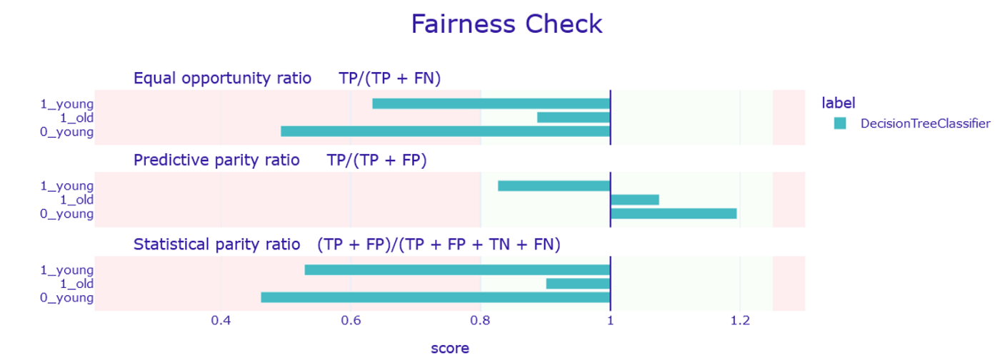

<!--truncate-->

---

Welcome to the third article of a series that aims to share how a group of private players (Danone, Ekimetrics, Datacraft) and researchers (Telecom Paris, Inria), partnered to uncover fairness & ethics in Artificial Intelligence from a practical standpoint. The group tried to tackle the following challenge: “how should a Data Scientist concretely react when exposed to fairness concerns?”. If you are interested to understand how this initiative kick started, have a look [here](https://datacraft-paris.github.io/blog/Des-biais-cognitifs-aux-biais-des-algorithmes).

These workshops led to the creation of an [AI ethics charter](https://datacraft-paris.github.io/trustworthyai/accountability.html), a [benchmark of (free/open-source) tools available on the market](http://tbd/) and a hands-on experiment to discover and mitigate biases in a prediction model. This article focuses on the last part but feel free to check out links for the first two ones.

**TL;DR**: This article focuses its analysis on algorithmic biases. Even if observed biases mostly come from biases in input data it is usually easier to observe and mitigate these biases by working with outcomes of machine learning models.


<div style={{'textAlign':'center', 'marginLeft': '9em', 'marginRight': '9em', 'marginBottom': '5em'}}>
Photo by <a target="_blank" rel="noopener noreferrer" href="https://unsplash.com/@tingeyinjurylawfirm?utm_source=unsplash&utm_medium=referral&utm_content=creditCopyText">Tingey Injury Law Firm</a> on <a target="_blank" rel="noopener noreferrer" href="https://unsplash.com/s/photos/justice?utm_source=unsplash&utm_medium=referral&utm_content=creditCopyText">Unsplash</a>.
</div>


Fairness is a very general concept whose meaning depends strongly on the context. In this article, we will focus on algorithmic biases which may be responsible for discriminative treatments on a subgroup of a population.

## Origin of biases

### Input data

In most cases, the input data used by a machine learning (ML) algorithm during its training is the main cause of the inequities observed in the algorithm’s outcomes.

Indeed, the data collection process can often lead to bias in the sense that the training sample is not representative of the population. Let us give two examples of these kinds of biases:  
* Selection Bias: Tracked data might not be representative of the true reality, such as data from people agreeing to answer a survey may not represent your entire population
* Measure Bias: Systematic measurement error (technical or not) like a camera contrast calibration which may not return the same degree of details from all skin colors.

Moreover, if the collected data are representative, it is only representative of the current state of the world, which, as you may know, is full of biases. Many unfair judgements such as racism and misogyny are still perpetuated, consciously or unconsciously, in some of our behaviors.

It is crucial for people technically in charge to be aware of all potential bias in order to check, control or alter data before any use.


#### Illustration with a dataset

Let’s use a biased dataset about [banking credit](https://www.kaggle.com/uciml/german-credit). It contains clients characteristics (savings, age, gender, etc.) and their classification as “at risk” or “not at risk” to default on their loan repayments. The risk assessment comes from an individual decision of a bank officer.

As a banking analyst and based on information just above, one might be afraid of the presence of social and cognitive biases in this data. For some reasons (ethical, legal, corporate branding, etc.) the bank (through its analysts) wants to be sure to have no bias according to age or gender in the decision to grant a credit.

As a first step, audit/exploration of data is mandatory. A lot of tools and products are available on the market to explore, visualize and dig into data. We decided to use an open-source tool that can be plugged in a python notebook: [Facets](https://pair-code.github.io/facets/) (from Google). Its interactive interface allows to display distributions, aggregated values and also intersect variables to discover cross-variable effects.


 visualization. Risk value splitted by Age and Gender.")
<div style={{'textAlign':'center', 'marginLeft': '9em', 'marginRight': '9em', 'marginBottom': '5em'}}>
Example of a Facets (Google) visualization. Risk value splitted by Age and Gender.
</div>


### Models predictions

It is usually easier to measure biases in model outcomes. Indeed, measuring biases inside a high dimensional dataset remains a challenge which gives rise to several research papers each year, while the outcome of an algorithm is usually a number which lends itself well to a statistical analysis. Still, the belief of the community is that a bias in the data should reflect in a bias in the outcomes.

#### Fairness Metrics

To check if a model is biased or not, some new metrics (instead of traditional model performance metrics) are needed. There are plenty of fairness-related metrics, but here are the 3 most commonly used ones:  
* Statistical/Demographic Parity: Groups have an equal probability of being positively predicted.
* Equal Odds: Groups have an equal True Positive Rate (probability of a true positive to be predicted positively among all true positives) and equal False Positive Rate (probability of a true negative to be predicted positively among all true negatives)
* Equal Opportunity: Groups have an equal probability of a False Negative Rate (probability of a true positive to be predicted negatively among all true positives)

During workshops, we mainly used a python package called “Dalex” to measure unfairness of results. Since this tool was not mentioned in the benchmark, let’s start by a quick presentation.


#### Dalex
The [Dalex](https://github.com/ModelOriented/DALEX) package is an open-source library developed in R and python by [MI²DataLab](https://www.mi2.ai/), a research group in machine learning, based in the Warsaw University of Technology. Both libraries have been maintained by the team since their creation in 2018.

#### How to use Dalex (python version)
The dalex package is quite easy to use and can be added to any existing machine learning project (under experimentation, or even in production). It is an on-top library providing explanations and measures of existing models. For instance, it interfaces particularly well with scikit-learn models.

In our case, it provides 2 highly relevant modules:  
* **Explainer**: This object encapsulates a model and its data. It can already provide some measures about the model and its performance (model type, set of predicted values, precision, f1-score, etc.). The use is as quick and easy as shown below.

```python
import dalex
explainer_object = dalex.Explainer(fitted model, 
    explanatory_columns_train_set, target_column_train_set)
```

* **Fairness Object**: This object (based on the Explainer one) allows to measure bias between some specified groups. These groups, also called “protected groups”, have to be manually defined. It is an easy task when protected groups are built on a qualitative variable (e.g. men VS women) but it’s more tricky when it is built on a quantitative variable (e.g. age). For the second case, the threshold to create two groups from a quantitative variable has to be set by the analyst (no automatic optimisation is done by Dalex to define the best threshold). So far, there are about 10 fairness metrics that are implemented to compare protected groups (including the 3 presented previously).

```python
fairness_object = explainer_object.model_fairness(
    protected = protected_variable, 
    privileged = protected_variable_value_used_as_reference)
```

It’s quite utapian to think it’s possible to achieve a perfect fairness according to multiple metrics (or even just one). It is more realistic to ensure a relatively equal treatment with an acceptance margin. Dalex provides this relative analysis with a by-default 20% margin (to learn more about this practice and this threshold, see the [Disparate Impact page](https://en.wikipedia.org/wiki/Disparate_impact)).

Based on the practical example, let’s visualize differences of treatment between groups. Let’s remind us all that the sensitive variables in the example are gender and age. Since the gender only contains 2 distinct values, the two natural groups from this variable are already set up. However the age variable is quantitative. By fixing an arbitrary threshold at 25 years old, it’s now possible to have 4 combined groups (gender and age): “0(male) old”, “1(female) young”, “1(female) old” and “0(male) young”. Among these groups, the one suspected of being favored is “male old” and will be used as reference to compute relative ratio. Below, a result according to 3 fairness metrics returned by Dalex.



<div style={{'textAlign':'center', 'marginLeft': '9em', 'marginRight': '9em', 'marginBottom': '5em'}}>
???????
</div>


Example of plot available in Dalex. This represents the relative treatment (compared to the reference group “male_old”) according to 3 fairness metrics for the 3 other groups. A bar in a green area means there is no bias (at a 20% level) for the fairness metric between the corresponding group and the reference group “male_old” for the trained decision tree model.

Thanks to Dalex, a quick view on the previous plot allows to highlight some bias issues in the treatment of young males and females compared to older males (reference group). Now that biases have been discovered, how can we deal with them? 


## Mitigation of biases
In a perfect world, data collection pipelines should be done regarding the possibilities of bias. However, most of the time, that’s already too late since data is already collected when the analyst has to create a prediction model. At this point, it’s still possible to unbias results by altering the input data (pre-processing), constraining the model (in-processing) or altering predictions (post-processing). All these solutions are possible (to a certain extent) with Dalex.

To keep this presentation as short and popularized as possible, lines of code for this part will not be displayed but notebooks are availables at the end.


### Pre-processing treatment
The pre-processing step is the modification of the input data to improve the fairness-performance of the model.

Two ways of dealing with this kind of treatment are implemented in Dalex:
* **Resampling observations**: Resampling commonly ensures a better balanced relative presence of each group.
* **Weighting observations**: Applying weights on observation allows to reduce or increase the impact of each observation to obtain a better consideration of minority cases.


 compared to the initial results (green) according to 3 fariness metrics.")
<div style={{'textAlign':'center', 'marginLeft': '9em', 'marginRight': '9em', 'marginBottom': '5em'}}>
Effect of a uniform resampling before the training (blue) compared to the initial results (green) according to 3 fariness metrics.
</div>


Effect of a uniform resampling before the training (blue) compared to the initial results (green) according to 3 fariness metrics.


## In-processing treatment
The classic way to train a ML model consists in learning parameters of an algorithm (e.g. SVM, RF…) so as to minimize a loss function $\mathcal{L}_{perf}$that accounts for the performance. In-processing mitigations of bias techniques consists in incorporating to the loss function another term criteria, $\mathcal{L}_{fair}$, , that also takes into account fairness constraints. Usually, the resulting loss function writes

\[ \mathcal{L} = \mathcal{L}_{perf} + \lambda \mathcal{L}_{fair}, \]

where $\lambda>0$ is a hyperparameter controlling the fairness-accuracy tradeoff (the larger it is, the more fair is the model). For instance, $\mathcal{L}_{fair}$ can be chosen as the absolute difference between false positive among males and false positive among females. Another promising line of search consists in taking $\mathcal{L}_{fair}$ as the opposite loss of a classifier designed to predict the gender, which results in so-called adversarial sensitive label removal techniques.


## Post-processing treatment
The last possibility is to alter outcomes of a model. This idea is to change some results to improve the fairness of the model with the least possible degradation of the model performance (f1-score, accuracy, etc.).

In a classication case (like the risk scoring), predictions close to the change of class (between “at risk” and “not at risk”) changes may be done in favor of the disadvantaged group or in disfavor of the advantaged one to rebalance the fairness-performance without perturbing the overall logic of the trained model.

Dalex offers 1 post-processing solution called “ROC-pivot” (in this context the name “ROC” might may you think about the ROC curve, but it’s not linked). It does basically what was explained just above. The “close to the change” has to be manually defined as margin value (usually a small value like 5 or 10% of the cutoff value between the two groups).


 compared to the initial results (green) according to 3 fairness metrics.")
<div style={{'textAlign':'center', 'marginLeft': '9em', 'marginRight': '9em', 'marginBottom': '5em'}}>
Effect of the Dalex ROC-pivot method (blue) compared to the initial results (green) according to 3 fairness metrics..
</div>


Effect of the Dalex ROC-pivot method (blue) compared to the initial results (green) according to 3 fairness metrics.


## Conclusion
Studying biases in machine learning is a growing field in the AI landscape and it will probably be a non-negligible part of the deployment process as soon as the European AI Act will be in effect.

Some tools like Dalex or [those presented in the first article of this series](http://tbd.com/) will probably be part of the Data Scientist toolkit as much as any machine learning library.

Before being backed into a corner, Data Scientists should first get familiar with the fairness field. As we saw, dealing with them is not easy and there is no magic recipe to mitigate an observed bias. Then, they should start thinking about efficient processes to deal with ethical questions since it will probably lead to cross-fields discussions with new stakeholders in the company (legal department, public relations department, etc.).


## Links & References
[Datacraft workshop notebook](https://github.com/datacraft-paris/ethical-ai-toolkit/blob/main/notebooks/ethical_ai.ipynb) (for full code)

[Dalex Github Repo](https://github.com/ModelOriented/DALEX)
